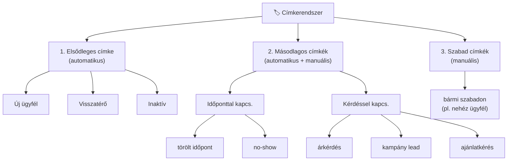

# 🏷️ DIGIDESK Címkerendszer — Teljes Áttekintés

## A spec 3 rétegű címkerendszert ír elő:

---

## 1. Elsődleges címke (Spec III.2.1) — automatikus

> Az elsődleges címke **nem kézzel**, hanem **automatikusan** rendelődik az ügyfélhez.

| Címke | Logika | Jelenlegi állapot |
|---|---|---|
| **ÚJ ÜGYFÉL** | Először lép kapcsolatba a céggel (0-1 időpont) | ✅ **Működik** — `countClientAppointments() <= 1` |
| **VISSZATÉRŐ** | Több mint 1 időpontja van | ✅ **Működik** — `countClientAppointments() > 1` |
| **INAKTÍV** | A cég által megadott időn belül nem történt foglalása | ❌ **Nem implementált** — nincs inaktivitási időhatár beállítás |

> [!IMPORTANT]
> Az **INAKTÍV** címkéhez kellene egy beállítás a Tudástárban: „Hány nap inaktivitás után legyen valaki inaktív?" (pl. 60 nap).
> Ha az ügyfél utolsó interakciója régebbi, mint ez az időhatár → automatikusan INAKTÍV címkét kap.

---

## 2. Másodlagos címkék (Spec III.2.2) — automatikus + interakció-alapú

> Ezek **interakciókhoz** is és **ügyfelekhez** is tartozhatnak.
> Egy ügyfélhez több, egy interakcióhoz is több címke.

### IDŐPONTTAL KAPCSOLATOS:

| Címke | Mikor kapja | Jelenlegi állapot |
|---|---|---|
| **törölt időpont** | Lemondás történt ÉS nem foglalt új időpontot | 🟡 Van `lemondott` státusz, de **nincs külön tag** |
| **no-show** | Időponton nem jelent meg | ❌ **Nincs implementálva** |

### KÉRDÉSSEL KAPCSOLATOS:

| Címke | Mikor kapja | Jelenlegi állapot |
|---|---|---|
| **árkérdés** | Interakció típusa árkérdés volt | 🟡 **Kézzel adható** tag-ként, de **nem automatikus** |
| **kampány lead** | Kampányra reagált az ügyfél | 🟡 **Kézzel adható** tag-ként, de **nem automatikus** |
| **ajánlatkérés** | Ajánlatkérés típusú interakció | 🟡 **Kézzel adható** tag-ként, de **nem automatikus** |

> [!NOTE]
> A jelenlegi tagColors-ban ezek definiálva vannak (árkérdés, kampány lead, ajánlatkérés, törölt időpont, no-show, VIP) → **vizuálisan léteznek, de automatikusan NEM rendelődnek hozzá**.

---

## 3. Manuális / szabad címkék (Spec VI.4) 

> Az ügyfélprofilban az operátor bármilyen címkét hozzáadhat.

| Funkció | Jelenlegi állapot |
|---|---|
| Előre definiált címkékből választás | 🟡 Van tag szerkesztés, de **nincs predefined lista** |
| Szabad szavas címke (pl. „nehéz ügyfél") | ✅ **Működik** — `tags` tömb a `custom_data`-ban |
| Címke törlés az ügyfélprofilból | ✅ **Működik** — „x" gomb a címkén |
| Címke hozzáadás gomb | ✅ **Működik** — „+ Címke hozzáadása" gomb |

---

## 4. Automatikus címkézési szabályok (Spec VI.5) — Tudástár

> A Tudástárban paraméterezhető lenne, hogy milyen események milyen címkét triggereljenek.

| Szabály | Jelenlegi állapot |
|---|---|
| Születési dátum → korcsoport-címke | ❌ Nincs |
| Preferált csatorna → csatornapreferencia-címke | ❌ Nincs |
| Árkérdés interakció → árkérdés tag | ❌ Nincs (kézi) |
| Kampányra reagált → kampány lead tag | ❌ Nincs (kézi) |
| Időpont törölve + nem foglalt újra → törölt időpont tag | ❌ Nincs |

> [!WARNING]
> Ez a **legkomplexebb** rész — a Tudástárba kellene egy szabályszerkesztő UI, ahol trigger → címke párokat lehet definiálni.

---

## 5. Hol jelennek meg a címkék?

| Helyszín | Elsődleges | Másodlagos | Szabad | Állapot |
|---|---|---|---|---|
| **Ügyféllista** (táblázat) | ✅ ÚJ/VISSZATÉRŐ badge | ✅ Címkék oszlop | ✅ Címkék oszlop | ✅ Működik |
| **Ügyféllista** (kártya nézet) | ✅ ÚJ/VISSZATÉRŐ badge | ✅ Tag pill-ek | ✅ Tag pill-ek | ✅ Működik |
| **Ügyfélprofil** (detail) | ✅ Badge a név mellett | ✅ Címkék kártya | ✅ Címkék kártya | ✅ Működik |
| **Interakciós lista** | ❌ Nincs | ❌ Nincs | ❌ Nincs | ❌ Hiányzik |
| **Interakciós összefoglaló** | ❌ Nincs | ❌ Nincs | ❌ Nincs | ❌ Hiányzik |
| **Kanban kártya** | ❌ Nincs | ❌ Nincs | ❌ Nincs | ❌ Hiányzik |
| **Kampány szűrés** | ❌ | ❌ | ❌ | ❌ Nem lehet címke szerint szűrni |

---

## Összegzés — Mi van és mi hiányzik

### ✅ Ami MŰKÖDIK:
1. ÚJ ÜGYFÉL / VISSZATÉRŐ automatikus meghatározás (időpont-számolás)
2. Manuális tag-ek hozzáadása/törlése az ügyfélprofilban
3. Vizuális megjelenés az ügyféllistában (táblázat + kártya)
4. Tag színek definiálva a fő másodlagos címkékhez

### ❌ Ami HIÁNYZIK:
1. **INAKTÍV** automatikus elsődleges címke (inaktivitási időhatár beállítás)
2. **Másodlagos címkék automatikus hozzárendelése** interakciók alapján
3. **no-show** detektálás és tag
4. **Címke-alapú szűrés** az ügyféllistában (kiválasztom pl. „árkérdés" → csak azokat mutatja)
5. **Címkék megjelenítése** az interakciós listában és kanban-ban
6. **Predefined címke lista** amiből az operátor választhat (jelenleg szabad szöveges)
7. **Automatikus címkézési szabályok** a Tudástárban (trigger → címke párok)
8. **Kampány célcsoport szűrés** címkék alapján
