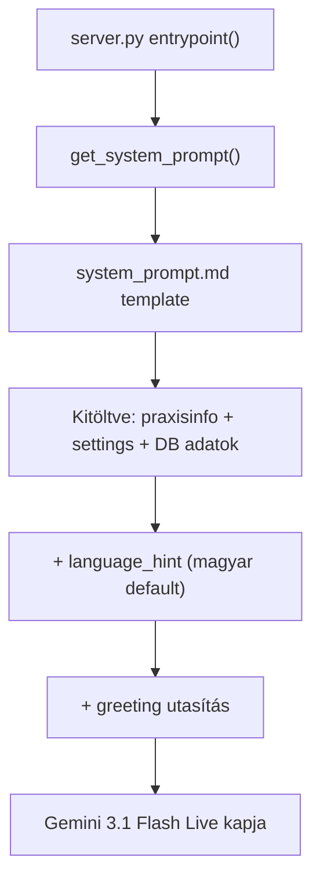
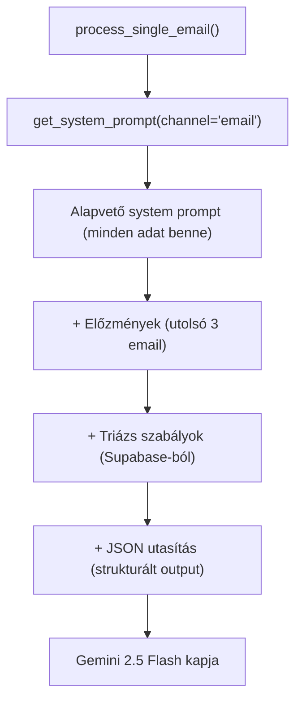
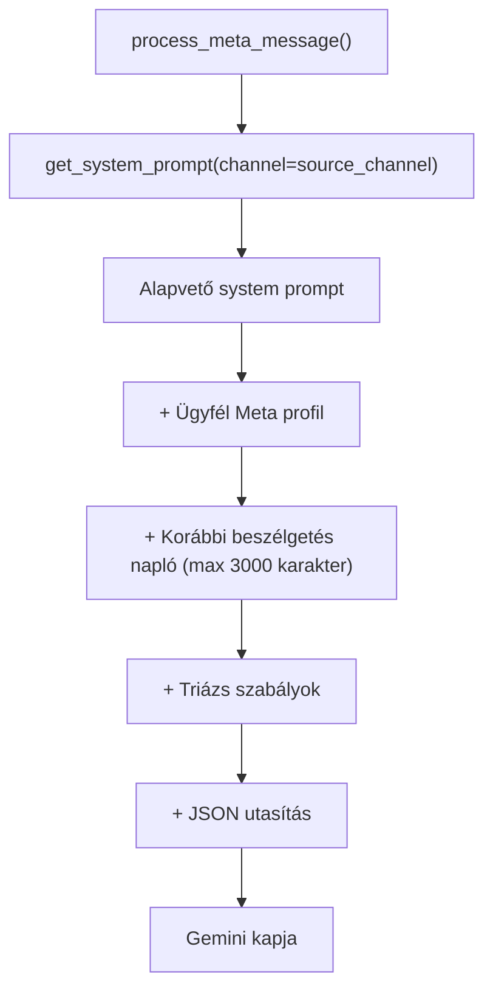
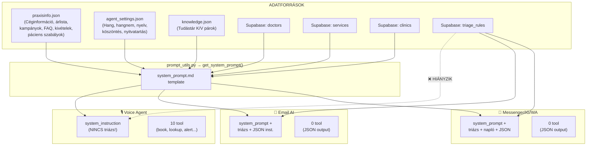
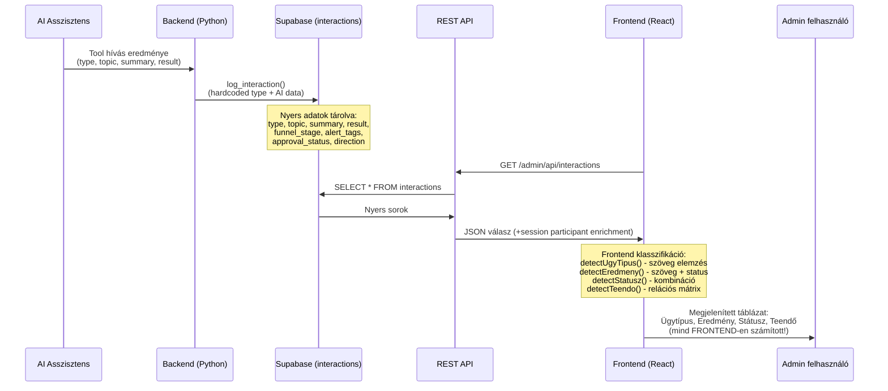

# 🧠 AI Tudástár Működés — Teljes Audit

## Összefoglaló

Az AI asszisztens **3 fő csatornán** keresztül dolgozik, és minden csatornán ugyanazt a `get_system_prompt()` függvényt használja a tudástár összeállításához, de vannak **fontos különbségek** a csatornák között.

---

## 1. Az adatforrások és bekerülésük a promptba

Az AI az alábbi forrásokból kapja az adatait, amelyek a [system_prompt.md](file:///c:/Users/dani%20pc%20xd/Desktop/Projectek/agent-main/thinkai-voice-agent/system_prompt.md) template-be injektálódnak:

| Adattípus | Forrás | Template változó | Az AI látja? |
|-----------|--------|-----------------|--------------|
| Cégnév, cím, márkanév, szakterület, kulcsszavak, megközelítés | `praxisinfo.json` | `{practice_name}`, `{address}`, `{markanev}`, stb. | ✅ Igen |
| Árlista | `praxisinfo.json` → `price_list` | `{price_list}` | ✅ Igen |
| Orvosok/Munkatársak | **Supabase `doctors` tábla** | `{doctors}` | ✅ Igen |
| Szolgáltatások | **Supabase `services` tábla** (+ doctor JOIN) | `{services_list}` | ✅ Igen |
| Kampányok | `praxisinfo.json` → `campaigns[]` | `{campaigns}` | ✅ Igen |
| Kivételek | `praxisinfo.json` → `exceptions[]` | `{exceptions}` | ✅ Igen |
| Lemondási/módosítási szabályok | `praxisinfo.json` → `modositas_eng`, `lemondas_24h`, stb. | `{cancellation_policy}` | ✅ Igen |
| Páciens kezelés szabályok | `praxisinfo.json` → `pacient_id_question`, `new_patient_*`, stb. | `{patient_rules}` | ✅ Igen |
| GYIK (FAQ) | `praxisinfo.json` → `faq[]` | `{faq}` | ✅ Igen |
| Tudásbázis (K/V párok) | `knowledge.json` VAGY `knowledge.md` | `{knowledge}` | ✅ Igen |
| Nyitvatartás | `agent_settings.json` → `business_hours` | `{business_hours}` | ✅ Igen |
| Hangnem (tone) | `agent_settings.json` → `tone` | `{tone}` | ✅ Igen |
| Telephelyek | **Supabase `clinics` tábla** | `{clinics_prompt}` | ✅ Igen |
| Triázs szabályok | **Supabase `triage_rules` tábla** | ⚠️ **Csak text csatornákon** | ⚠️ Részleges |
| Nyelvi szabály | `agent_settings.json` → `language` | `{language_rule}` | ✅ Igen |

---

## 2. Csatornánkénti adatláthatóság

### 🎙️ Voice Agent (LiveKit / server.py)



> [!WARNING]
> **A Voice Agent NEM kapja meg a triázs szabályokat!** A [server.py](file:///c:/Users/dani%20pc%20xd/Desktop/Projectek/agent-main/thinkai-voice-agent/server.py#L196) csupán a `get_system_prompt()` hívja, de a triázs szabályokat a text csatornák **manuálisan** appendelik a prompthoz. A voice agentnek van `report_alert` tool-ja (ami tud urgent tag-et logolni), de a triázs szabályokat nem látja, tehát **nem tudja automatikusan felismerni a prioritásokat**.

> [!IMPORTANT]
> **A Voice Agent-nek van `lookup_info` tool-ja**, ami egy KÜLÖN mechanizmus a `knowledge.json`-ból történő kereséshez. Ez azt jelenti, hogy a voice agent **kétszer** kapja meg a tudástárat:
> 1. A system promptba injektálva (K:/V: formátumban)
> 2. A `lookup_info` tool-on keresztül (ha explicit meghívja)
>
> Ez redundáns, de nem káros — a tool részletesebb keresést (alias matching, fuzzy, full-text) is biztosít.

---

### 📧 Email AI (email_processor.py)



> [!NOTE]
> Az email csatorna **a legteljesebb**: megkapja az alapvető system promptot + triázs szabályokat + email előzményeket. Viszont **nincs `lookup_info` tool-ja** — az AI nem tud kérdezni a tudástárból, hanem mindent egyszerre kap a promptban.

---

### 💬 Messenger/Instagram/WhatsApp (web_server.py → process_meta_message)



> [!NOTE]
> A Messenger csatorna szintén teljes, de a **beszélgetés előzménye le van vágva 3000 karakterre**. Hosszú beszélgetéseknél kontextust veszíthet.

---

## 3. 🚨 Azonosított logikai buktatók

### ❌ 1. Buktató: Triázs szabályok NEM jutnak el a Voice Agenthez

| Csatorna | Triázs szabályok? |
|----------|------------------|
| Voice | ❌ **NEM** |
| Email | ✅ Igen |
| Messenger/IG/WA | ✅ Igen |

**Probléma:** Ha egy hívó sürgős problémát jelez (pl. "nagyon fáj a fogam, vérzik"), a voice agent nem tudja összepárosítani a triázs szabályokkal. Csak a `report_alert` tool-t tudja használni, de az ő saját döntésén múlik, hogy meghívja-e.

**Javítási javaslat:** A `server.py`-ban a `get_system_prompt()` hívás után appendelni kellene a triázs szabályokat, hasonlóan ahogy az email/messenger csatornák teszik:
```python
triage_rules = db.get_triage_rules()
if triage_rules:
    rules_text = "\n".join([f"- {r['situation']}: {r['priority']}" for r in triage_rules])
    system_instruction += f"\n\n--- TRIÁZS SZABÁLYOK ---\n{rules_text}\n"
```

---

### ⚠️ 2. Buktató: Duplikált tudástár hozzáférés a Voice Agentben

A voice agent **kétszer** kapja meg a `knowledge.json` tartalmát:
1. **System promptba injektálva** (K:/V: párokként a `{knowledge}` placeholder-en keresztül)
2. **`lookup_info` tool-on keresztül** (ami újra olvassa a `knowledge.json`-t lemezről)

Ez nem hiba, de **felesleges token-felhasználás**. A system prompt már tartalmazza az összes infót, a tool csak akkor ad hozzáadott értéket, ha a promptba injektált verzió nem elegendő (pl. nagyon hosszú tudástár).

---

### ⚠️ 3. Buktató: Nyitvatartási idő betartatása nincs validálva

A system promptban van ugyan „SZIGORÚ SZABÁLY: Kizárólag a nyitvatartási időn belülre foglalhatsz időpontot!", de a `book_meeting` tool-ban a [_find_next_slot](file:///c:/Users/dani%20pc%20xd/Desktop/Projectek/agent-main/thinkai-voice-agent/tools.py#L384-L409) fix 18:00-ig keres szabad slotot, **nem veszi figyelembe a tényleges nyitvatartási időt az `agent_settings.json`-ból**.

**Probléma:** Ha a rendelő 16:00-ig nyitva van, a tool mégis ajánlhat 17:00-ra slotot. Az AI „szövegben" tudja, hogy nem kellene, de a tool nem validálja.

**Javítási javaslat:** A `_find_next_slot` és a `book_meeting` függvényeknek be kellene olvasniuk a `business_hours`-t és validálni.

---

### ⚠️ 4. Buktató: `praxisinfo.json` doctors tömbje üres, de az orvosok Supabase-ból jönnek

A [praxisinfo.json](file:///c:/Users/dani%20pc%20xd/Desktop/Projectek/agent-main/thinkai-voice-agent/praxisinfo.json#L14)-ben `"doctors": []` van. Az AI **nem innen** kapja az orvosokat, hanem a **Supabase `doctors` táblából**, a [_format_doctors()](file:///c:/Users/dani%20pc%20xd/Desktop/Projectek/agent-main/thinkai-voice-agent/prompt_utils.py#L60-L71) függvényen keresztül.

Ez jól működik, de **ha a Supabase nem elérhető** (pl. hálózati hiba), az AI „Nincs megadva" szöveget kap az orvosokra és szolgáltatásokra vonatkozóan.

---

### ⚠️ 5. Buktató: `book_meeting` tool-ban az orvos naptárja nincs külön kezelve

A `book_meeting` egyetlen globális naptárban keres ütközéseket (`db.get_calendar_events()`), de **nem szűr orvosra**. Ha Dr. A foglalt 10:00-kor, akkor Dr. B-hez sem lehet foglalni 10:00-ra, mert az ütközést a globális naptárban észleli.

---

### ⚠️ 6. Buktató: Az `agent_settings.json` greeting inkonzisztens a practice_name-mel

A jelenlegi greeting: *„Szia! A **Fogmed** virtuális asszisztense vagyok"* — de a `praxisinfo.json`-ban a practice_name `"DentalMedical Kft."` és a márkanév `"DenMed"`. Ez **tesztelési maradvány**, de mutatja, hogy a greeting manuálisan van beállítva és nem automatikusan a cégnévből generálódik.

---

### ⚠️ 7. Buktató: A text csatornák (email/messenger) NEM kapnak tool-okat

A voice agent 10 tool-t kap (naptár, foglalás, email küldés, stb.), míg az email/messenger csatornák **semmilyen tool-t nem kapnak**. Ehelyett egy **JSON output struktúrát** kell visszaadniuk, amit a web_server/email_processor manuálisan feldolgoz.

Ez azt jelenti:
- A voice agent **valós időben** tud foglalni, naptárt nézni, emailt küldeni
- Az email/messenger AI csak **javaslatot tesz** (pl. „meeting" mezőben), amit a háttérben a kód hajt végre

Ez helyes architekturális döntés, de a voice agent és text AI eltérő képességeket kap.

---

### ⚠️ 8. Buktató: Beszélgetés napló levágás (3000 karakter)

A Messenger csatornánál a [beszélgetés előzménye](file:///c:/Users/dani%20pc%20xd/Desktop/Projectek/agent-main/thinkai-voice-agent/web_server.py#L1253-L1257) **max 3000 karakter**. Hosszú, több fordulós beszélgetéseknél az AI elveszíti a korábbi kontextust, és **ismételt kérdéseket tehet fel**, vagy elfelejthet korábban megadott adatokat.

---

## 4. 📊 Adatfolyam összefoglaló diagram



---

## 5. ✅ Ami jól működik

1. **Központosított prompt-építés** — A `prompt_utils.py` minden csatornának ugyanazokat az alapadatokat biztosítja
2. **Dinamikus adatok** — Orvosok, szolgáltatások, telephelyek Supabase-ból jönnek, tehát valós időben frissülnek
3. **GYIK SZIGORÚ kezelése** — A FAQ „KÖTELEZŐEN" az ott megadott választ kell adja
4. **Kampányok kezelése** — „SOHA ne mondd, hogy nincs aktív kampányunk" — jó védelem a hamis negatív ellen
5. **Nyelvi támogatás** — 10 nyelven erős utasítás a célnyelv betartására
6. **Páciens azonosítás workflow** — Jól strukturált új/visszatérő páciens kezelés
7. **Automatikus ügyfél-címkézés** — Háttérben fut, nem zavarja az ügyfelet

---

## 6. 📋 Javasolt prioritásos javítások

| # | Buktató | Súlyosság | Javítás |
|---|---------|-----------|---------|
| 1 | Triázs szabályok hiánya a Voice Agentben | 🔴 Magas | Triázs szabályok appendelése a `server.py`-ban |
| 2 | Nyitvatartás nem validált a `book_meeting`-ben | 🟡 Közepes | `business_hours` beolvasása és validálás a tool-ban |
| 3 | Orvosokra nem szűr a naptár | 🟡 Közepes | Per-orvos naptár kezelés implementálása |
| 4 | Beszélgetés napló levágása | 🟡 Közepes | Összegző mechanizmus (summarize & compress) |
| 5 | Duplikált tudástár (prompt + tool) | 🟢 Alacsony | Token optimalizálás (csak tool VAGY prompt) |
| 6 | Greeting inkonzisztencia | 🟢 Alacsony | Auto-generálás a practice_name-ből |

---
---

# 📋 Interakciós Napló Rendszer — Részletes Audit

## 7. Az interakciós napló adatfolyama

### 7.1. Honnan nyeri az adatokat az AI?

Az interakciós napló a Supabase `interactions` táblába ír, a `log_interaction()` függvényen ([database.py:234](file:///c:/Users/dani%20pc%20xd/Desktop/Projectek/agent-main/thinkai-voice-agent/database.py#L234)) keresztül. Az adatokat **4 különböző forrás** tölti:

```mermaid
flowchart TB
    subgraph VOICE["🎙️ Voice Agent (tools.py)"]
        V1["send_followup_email → type='email'"]
        V2["check_calendar → type='kérdés'"]
        V3["book_meeting → type='foglalás'"]
        V4["get_weather → type='kérdés'"]
        V5["create_task → type='feladat'"]
        V6["lookup_info → type='kérdés'"]
        V7["report_alert → type='voice_alert'"]
    end

    subgraph EMAIL["📧 Email Processor"]
        E1["process_single_email → type='email'"]
        E2["reminder_worker → type='email'"]
        E3["automation_worker → type='email'"]
    end

    subgraph MSG["💬 Messenger/IG/WA (web_server.py)"]
        M1["process_meta_message → type=csatorna neve"]
        M2["spam_filter → type=csatorna neve"]
    end

    subgraph CAMPAIGN["📞 Outbound Campaign"]
        C1["phone_campaign_worker → type='Telefon'"]
    end

    DB[("Supabase<br/>interactions tábla")]

    V1 & V2 & V3 & V4 & V5 & V6 & V7 --> DB
    E1 & E2 & E3 --> DB
    M1 & M2 --> DB
    C1 --> DB
```



### 7.2. A `log_interaction()` függvény paraméterei

A [database.py:234](file:///c:/Users/dani%20pc%20xd/Desktop/Projectek/agent-main/thinkai-voice-agent/database.py#L234) a következő adatokat menti:

| Paraméter | Típus | Leírás | Ki tölti? |
|-----------|-------|--------|-----------|
| `type` | string | Csatorna/ügytípus (pl. "email", "foglalás", "messenger") | Backend (hardcoded) |
| `topic` | string | Az interakció témája szabadon | Backend (részben AI adat) |
| `summary` | string | Rövid összefoglaló | Backend (részben AI adat) |
| `result` | string | Eredmény szöveg | Backend (hardcoded) |
| `tool_name` | string | Melyik tool hívta | Backend (hardcoded) |
| `session_id` | string | Session azonosító | Backend (automatikus) |
| `funnel_stage` | string | Pipeline állapot | Backend / AI döntés |
| `alert_tags` | list | Riasztási címkék | AI + backend analízis |
| `handover_reason` | string | Átadás oka | AI döntés |
| `direction` | string | "inbound" / "outbound" | Backend (hardcoded) |
| `approval_status` | string | "pending" / "approved" / "rejected" / "spam" | Backend |
| `ai_draft_response` | string | AI válasz piszkozat (JSON) | AI generálja |
| `clinic_id` | int | Telephely ID | AI / Backend |

---

## 8. Jelenleg használt értékek (teljes lista)

### 8.1. ÜGYTÍPUS (type → frontend: Ügytípus)

> [!IMPORTANT]
> A backend `type` mező és a frontend **Ügytípus** oszlop NEM ugyanaz! A backend nyers `type` értékét a frontend [interactionClassifiers.ts](file:///c:/Users/dani%20pc%20xd/Desktop/Projectek/agent-main/thinkai-voice-agent/eaisydesk-frontend/src/helpers/interactionClassifiers.ts) fájl **szöveg-elemzéssel** konvertálja.

#### Backend nyers `type` értékek (amit a DB-be ír):

| `type` érték | Honnan jön | Mikor |
|-------------|------------|-------|
| `"email"` | tools.py, email_processor.py | Email küldés, bejövő email, emlékeztető, automatizáció |
| `"kérdés"` | tools.py | Naptár ellenőrzés, időjárás, tudásbázis keresés |
| `"foglalás"` | tools.py | Időpont lefoglalva (voice agent) |
| `"feladat"` | tools.py | Feladat/teendő rögzítés |
| `"voice_alert"` | tools.py | Riasztás (urgent/complaint/callback) |
| `"messenger"` | web_server.py | Messenger üzenet feldolgozás |
| `"instagram"` | web_server.py | Instagram DM feldolgozás |
| `"whatsapp"` | web_server.py | WhatsApp üzenet feldolgozás |
| `"Telefon"` | web_server.py | Kimenő kampány telefonhívás |

#### Frontend számított Ügytípus értékek (amit a felhasználó lát):

| Ügytípus | Detektálás logikája | Kulcsszavak |
|----------|-------------------|-------------|
| **Időpont** | topic/summary tartalmazza | "időpont", "foglal", "booking", "lemondás", "módosít", "emlékeztet" |
| **Kérdés** | topic/summary tartalmazza | "kérdés", "érdeklőd", "mennyi", "kerül", "ár", "hogyan", "jóváhagyás" |
| **Kérés** | topic/summary tartalmazza | "kérés", "igény", "request", "intézked" |
| **Panasz** | topic/summary tartalmazza | "panasz", "reklamáció", "complaint", "sürgős" |
| **Egyéb** | ha semmi nem illik | (default fallback) |

> [!WARNING]
> **Buktató:** Egy interakció **több ügytípust** is kaphat egyszerre (vesszővel elválasztva, pl. "Időpont, Kérdés"), ami a szűrést bonyolítja. A filter dropdown (`UGYTIPUS_OPTIONS`) viszont csak egyetlen értéket vár, így a kombinált típusok nem szűrhetők pontosan.

---

### 8.2. EREDMÉNY (result → frontend: Eredmény)

#### Backend nyers `result` értékek (hardcoded szövegek):

| `result` érték | Honnan | Mikor |
|---------------|--------|-------|
| `"Küldés sikeres"` | tools.py (send_followup_email) | Email sikeresen elküldve |
| `"Küldés sikertelen"` | tools.py (send_followup_email) | Email küldés hiba |
| `"X esemény"` | tools.py (check_calendar) | Naptár lekérdezés eredménye |
| `"Lefoglalva + Kanban kártya létrehozva"` | tools.py (book_meeting) | Sikeres foglalás |
| `"X°C, időjárás"` | tools.py (get_weather) | Időjárás lekérdezés |
| `"Rögzítve"` | tools.py (create_task) | Feladat mentve |
| `"tudástár szöveg..."` | tools.py (lookup_info) | Tudástár lekérdezés (max 100 karakter) |
| `"urgent, complaint, ..."` | tools.py (report_alert) | Alert tagek listája |
| `"Várakozik jóváhagyásra"` | web_server.py, email_processor.py | Text csatornák AI válasza |
| `"Elküldve"` | email_processor.py | Emlékeztető email kiküldve |
| `"Hívás indítva"` | web_server.py | Kampány telefonhívás elindítva |
| `"Automatikusan szűrve"` | web_server.py, email_processor.py | Spam üzenet szűrve |

#### Frontend számított Eredmény értékek (amit a felhasználó lát):

| Eredmény | Logika |
|----------|--------|
| **Új időpont** | funnel_stage="foglalt" VAGY type="foglalás" VAGY result tartalmazza "lefoglalva" |
| **Időpont módosítva** | topic/summary tartalmazza "módosít", "áthelyez", "változtat" |
| **Időpont törölve** | topic/summary tartalmazza "lemond", "töröl", "cancel" |
| **Időpont előkészítve** | Ügytípus=Időpont, de egyik sem illik fentről |
| **Megválaszolt kérdés** | approval_status="approved"/"rejected" VAGY result tartalmazza "megválaszol"/"sikeres" |
| **Jóváhagyásra vár** | approval_status="pending" |
| **Kérdés rögzítve** | Ügytípus=Kérdés, de nem megválaszolt és nem vár jóváhagyásra |
| **Igény rögzítve** | Ügytípus=Kérés/Egyéb |
| **Panasz rögzítve** | Ügytípus=Panasz |

---

### 8.3. STÁTUSZ (frontend: Státusz)

> [!NOTE]
> A státusz **nem a backend-ből jön**, hanem a frontend [detectStatusz()](file:///c:/Users/dani%20pc%20xd/Desktop/Projectek/agent-main/thinkai-voice-agent/eaisydesk-frontend/src/helpers/interactionClassifiers.ts#L237-L289) számítja az Ügytípus + Eredmény + approval_status + alert_tags kombinációjából.

| Státusz | Szín | Mikor |
|---------|------|-------|
| **Lezárt** 🟢 | Zöld | approval_status = "approved"/"rejected" ÉS nem panasz ÉS nem időpont-előkészítés; VAGY minden eredmény "megoldott" típusú |
| **Nyitott** 🟡 | Sárga | Pending jóváhagyás, időpont előkészítve, kérdés rögzítve, igény rögzítve |
| **Sürgős** 🔴 | Piros | Ügytípus=Panasz; VAGY alert_tags tartalmaz "urgent"; VAGY handover_reason tartalmaz "sürgős" |

#### A Relációs Mátrix (Ügytípus × Eredmény → Státusz + Teendő):

| Ügytípus | Eredmény | → Státusz | → Teendő |
|----------|----------|-----------|----------|
| Kérdés | Megválaszolt kérdés | Lezárt | Nincs további teendő |
| Kérdés | Jóváhagyásra vár | Nyitott | Válasz jóváhagyása szükséges |
| Kérdés | Kérdés rögzítve | Nyitott | Válasz szükséges |
| Időpont | Új időpont | Lezárt | Nincs további teendő |
| Időpont | Időpont módosítva | Lezárt | Nincs további teendő |
| Időpont | Időpont törölve | Lezárt | Nincs további teendő |
| Időpont | Időpont előkészítve | Nyitott | Időpont véglegesítése |
| Kérés | Igény rögzítve | Nyitott | Intézkedés szükséges |
| Panasz | Panasz rögzítve | Sürgős | Azonnali beavatkozás |
| Egyéb | Igény rögzítve | Nyitott | Intézkedés szükséges |

---

### 8.4. TEENDŐ (frontend: Teendő)

| Teendő | Mikor jelenik meg |
|--------|------------------|
| **Nincs további teendő** | Lezárt ügy (megválaszolt, lefoglalt, módosított, törölt) |
| **Válasz jóváhagyása szükséges** | AI draft vár jóváhagyásra (pending) |
| **Válasz szükséges** | Kérdés rögzítve, de nincs válasz |
| **Időpont véglegesítése** | Időpont előkészítve, de nem végleges |
| **Intézkedés szükséges** | Kérés/igény rögzítve |
| **Azonnali beavatkozás** | Panasz rögzítve |

---

## 9. 🚨 Interakciós napló backend buktatók

### ❌ 9.1. Buktató: Backend `type` mező inkonzisztens

A backend `type` mező értékei **eltérő konvenciókat** követnek:

| Forrás | Példa `type` értékek | Probléma |
|--------|---------------------|----------|
| tools.py | `"email"`, `"kérdés"`, `"foglalás"`, `"feladat"` | **Kisbetűs magyar** |
| web_server.py (messenger) | `"messenger"`, `"instagram"`, `"whatsapp"` | **Kisbetűs angol** |
| web_server.py (kampány) | `"Telefon"` | **Nagybetűs magyar!** |
| email_processor.py (spam) | `"email"` | Kisbetűs |

A `"Telefon"` nagybetűs, míg az összes többi kisbetűs. Ez a frontend `getRowChannel()` függvényében ugyan kezelve van, de a Supabase lekérdezéseknél (pl. analytics) a `type` szűrés érzékeny erre.

---

### ⚠️ 9.2. Buktató: A frontend NEM a backend `result` mezőt jeleníti meg

A frontenden látható **Eredmény** oszlop **NEM** a Supabase `result` mező tartalmát mutatja. Ehelyett a [detectEredmeny()](file:///c:/Users/dani%20pc%20xd/Desktop/Projectek/agent-main/thinkai-voice-agent/eaisydesk-frontend/src/helpers/interactionClassifiers.ts#L160-L235) szöveg-elemzéssel számítja a `topic`, `summary`, `result`, `funnel_stage`, és `approval_status` mezők kombinációjából.

**Ez azt jelenti:**
- A backend `result` mező értékei (pl. "Lefoglalva + Kanban kártya létrehozva") **soha nem jelennek meg** közvetlenül a UI-on
- Ha a kulcsszó-keresés nem találja meg a megfelelő szót, **rossz eredmény-kategóriát** kap
- Pl. ha a `topic` nem tartalmazza az "időpont" szót, de `type="foglalás"`, az is kaphat "Időpont" ügytípust a `detectUgyTipus()`-ban — de a `detectEredmeny()` más logikát használ, ami inkonzisztenciát okozhat

---

### ⚠️ 9.3. Buktató: Státusz számítás kétféle úton

A `detectStatusz()` **két konkurens logikát** használ:
1. Az `approval_status` alapján (ha "approved"/"rejected" → Lezárt)
2. Az Eredmény alapján (relációs mátrix)

**Probléma:** Ha egy panaszos ügyet jóváhagynak (`approval_status="approved"`), a státusz **Sürgős** marad (mert a panasz prioritást kap), de a teendő **"Azonnali beavatkozás"** lesz, ami nem biztos, hogy helyes ha már kezelték.

---

### ⚠️ 9.4. Buktató: A `funnel_stage` értékek inkonzisztensek

| Forrás | Lehetséges értékek | Probléma |
|--------|-------------------|----------|
| tools.py | `"irrelevant"`, `"relevant"`, `"valaszolt"`, `"ajanlat"`, `"foglalt"` | Magyar/angol keverék |
| web_server.py (messenger) | `"foglalt"`, `"valaszolt"` | Csak 2 értéket használ |
| web_server.py (kampány) | `"relevans"` | Elírás! (kellene: `"relevant"`) |
| email_processor.py | `"valaszolt"`, `"foglalt"`, `"spam"`, `"relevans"` | `"relevans"` vs `"relevant"` |

A `"relevans"` és `"relevant"` eltérés **két különböző funnel állapotnak számít** a statisztikákban. Az analytics dashboardon ez torzítja az adatokat.

---

### ⚠️ 9.5. Buktató: Spam interakciók a DB-ben maradnak

A spam üzenetek (`approval_status="spam"`) rögzítésre kerülnek a `interactions` táblába. A frontend kiszűri őket (`if (r.approval_status === 'spam') return;`), de:
- A DB-ben egyre növekszenek
- Az analytics lekérdezések (`get_funnel_stats`) nem szűrik ki explicit módon
- A `total_interactions` szám tartalmazza a spam rekordokat is

---

### ⚠️ 9.6. Buktató: A `result` mező a `lookup_info`-nál levágott

A [lookup_info](file:///c:/Users/dani%20pc%20xd/Desktop/Projectek/agent-main/thinkai-voice-agent/tools.py#L639) tool az eredményt **max 100 karakterre** vágja: `result[:100] + "..."`. Ez az interakciós naplóban nem nyújt hasznos információt arról, hogy az AI milyen választ adott.

---

### ⚠️ 9.7. Buktató: Kombinált ügytípusok szűrési problémája

A `detectUgyTipus()` visszaadhat **vesszővel elválasztott kombinált értéket** (pl. `"Időpont, Kérdés"`). Viszont:
- A szűrő opciók egyedi értékeket listáznak: `['Időpont', 'Kérdés', 'Kérés', 'Panasz', 'Egyéb']`
- A szűrő `filterUgyTipus.has(r.ugyTipus)` **pontos egyezést** keres
- Tehát a `"Időpont, Kérdés"` kombinált érték **egyik szűrőre sem illeszkedik** → kiesik minden szűrésnél

---

## 10. 📊 Teljes adatfolyam — Backend → Frontend



> [!CAUTION]
> **Kritikus felismerés:** Az interakciós napló megjelenített értékeinek (Ügytípus, Eredmény, Státusz, Teendő) **egyike sem a backend-ből jön közvetlenül**. Minden a frontend `interactionClassifiers.ts` fájlban, **kulcsszó-alapú szövegelemzéssel** számítódik. Ez törékeny, mert:
> 1. Ha a backend egy kicsit más szöveget ír a `topic`-ba, a frontend hibásan klasszifikálhat
> 2. Nincs „single source of truth" — a backend és frontend eltérő értékeket jeleníthet meg
> 3. Az analytics (backend oldalon) más logikát használ, mint az interakciós naplóban (frontend oldalon) látható

---

## 11. 📋 Interakciós napló javasolt javítások

| # | Buktató | Súlyosság | Javítás |
|---|---------|-----------|---------|
| 9.1 | Inkonzisztens `type` (nagybetű/kisbetű) | 🟡 Közepes | Egységesítés: mindig kisbetűs |
| 9.2 | Frontend szövegelemzés ↔ backend eltérés | 🔴 Magas | Backend-en is számítani az ügytípust/eredményt, vagy legalább normalizálni a `result` mezőt |
| 9.3 | Panasz + jóváhagyás státusz-ütközés | 🟡 Közepes | Jóváhagyás utáni állapot-frissítés |
| 9.4 | `"relevans"` vs `"relevant"` elírás | 🟡 Közepes | Egységesítés egy helyes értékre |
| 9.5 | Spam rekordok halmozódása | 🟢 Alacsony | Archiv/törlés policy vagy analytics kizárás |
| 9.6 | `lookup_info` result levágás | 🟢 Alacsony | Hosszabb result vagy külön mező |
| 9.7 | Kombinált ügytípus szűrés | 🟡 Közepes | `.includes()` használata `.has()` helyett a szűrőben |
