# 🔧 Javítási Javaslatok — Vélemény & Prioritások

> [!NOTE]
> Ez a dokumentum **nem implementáció** — csak gondolkodás. A cél: megérteni, mi éri meg a ráfordítást, mi az ami "szép lenne de nem sürgős", és mi az ami jelenleg is jól működik és nem kell hozzányúlni.

---

## Filozófia: Mire érdemes időt szánni?

Az EAISY rendszer jelenleg egy **működő termék** — ügyfeleket szolgál ki, időpontot foglal, emailt válaszol. A javítások sorrendjénél szerintem ez a 3 kérdés a lényeg:

1. **Van-e valós ügyfélhatás?** (Elveszítünk ügyfelet? Rossz adatot kap a felhasználó?)
2. **Mennyire nehéz javítani?** (5 perc vs. 2 nap átírás)
3. **Skálázási problémát okoz?** (10 ügyfélnél oké, 100-nál nem?)

---

## 🏆 Tier 1 — Azonnal érdemes javítani (magas hatás, alacsony ráfordítás)

### 1. ✅ `"relevans"` vs `"relevant"` elírás javítása

| | |
|---|---|
| **Ráfordítás** | ⏱️ 5 perc |
| **Hatás** | Az analytics dashboard torzított adatokat mutat |
| **Vélemény** | Ez egy egyszerű typo. 2 helyen kell átírni: `web_server.py` kampány logolás és `email_processor.py` reminder/automation. Triviális fix, nincs mellékhatása. |

**Javaslat:** Egységesen `"relevant"` legyen mindenhol (ez az ami a tools.py-ban is van).

---

### 2. ✅ `"Telefon"` nagybetűs type javítása

| | |
|---|---|
| **Ráfordítás** | ⏱️ 2 perc |
| **Hatás** | Potenciálisan elrontja a type-based szűréseket az analytics-ben |
| **Vélemény** | Szintén triviális. A `web_server.py` kampány hívás logolásánál `type="Telefon"` → `type="telefon"`. |

---

### 3. ✅ Triázs szabályok hozzáadása a Voice Agenthez

| | |
|---|---|
| **Ráfordítás** | ⏱️ 15 perc |
| **Hatás** | 🔴 **MAGAS** — jelenleg egy sürgős hívó (pl. "nagyon vérzik a fogam") nem kap prioritásos kezelést a voice csatornán |
| **Vélemény** | Ez az egyetlen buktató, ami **valós ügyfélkockázatot** jelent. Ha egy ügyfél telefonon jelzi, hogy sürgős, az AI-nak tudnia kellene a triázs szabályokról, hogy ne foglaljon időpontot jövő hétre, hanem azonnal eszkalálja. |

**Javaslat:** A `server.py`-ban a `get_system_prompt()` hívás után 5 sor kód kell:
```python
triage_rules = db.get_triage_rules()
if triage_rules:
    rules_text = "\n".join([f"- {r['situation']}: {r['priority']}" for r in triage_rules])
    system_instruction += f"\n\n--- TRIÁZS SZABÁLYOK ---\n{rules_text}\n"
```

---

### 4. ✅ Kombinált ügytípus szűrés javítása

| | |
|---|---|
| **Ráfordítás** | ⏱️ 10 perc |
| **Hatás** | Az "Időpont, Kérdés" kombinált ügytípusok kiesnek MINDEN szűrésből |
| **Vélemény** | A fix egyszerű: az `InteractionsPage.tsx`-ben a `filterUgyTipus.has(r.ugyTipus)` lecserélhető egy `.some()` ellenőrzésre, ami a vesszővel elválasztott értékeket is kezeli. De... |

> [!TIP]
> **Érdemes elgondolkodni**: Kell-e egyáltalán, hogy egy interakció több ügytípust kapjon? Az esetek 90%-ában egy interakciónak EGY típusa van. A `detectUgyTipus()` "Időpont, Kérdés" visszatérése inkább azt jelzi, hogy a szövegelemzés nem elég finom, nem azt, hogy tényleg kettős típusú az interakció. **Ha egyetlen "legerősebb" típust választanánk, egyszerűbb lenne az egész rendszer.**

---

## 🥈 Tier 2 — Érdemes javítani, de nem sürgős (közepes hatás)

### 5. ⏳ Nyitvatartás validálás a `book_meeting` toolban

| | |
|---|---|
| **Ráfordítás** | ⏱️ 30-45 perc |
| **Hatás** | Elméletileg ajánlhat 17:00-ra slotot, ha a rendelő 16:00-ig nyitva van |
| **Vélemény** | Ez a gyakorlatban **ritkán okoz problémát**, mert az AI a system promptban kapja meg a nyitvatartást szövegesen, és általában betartja. A tool-szintű validáció egy extra biztonsági háló lenne. Nem sürgős, de érdemes egyszer megcsinálni. |

**Ha csináljuk, akkor így:**
- A `book_meeting` és `_find_next_slot` beolvassák a `business_hours`-t az `agent_settings.json`-ból
- A slot keresés csak az adott nap nyitvatartási idején belül keres
- A foglalás elutasítja a nyitvatartáson kívüli időpontot explicit hibaüzenettel

---

### 6. ⏳ Panasz + jóváhagyás státusz-ütközés

| | |
|---|---|
| **Ráfordítás** | ⏱️ 20 perc |
| **Hatás** | Ha egy panaszos ügyet jóváhagynak, a státusz "Sürgős" marad örökre |
| **Vélemény** | Ez valós UX probléma — az admin nem tudja "lezárni" a panaszt vizuálisan. De a jelenlegi ügyfélszámmal nem kritikus. |

**Javaslat:** A `detectStatusz()`-ban ha `approval_status === 'approved'` ÉS a `handover_reason` nem tartalmaz sürgős szót, akkor a panasz is legyen "Lezárt". Alternatíva: vezessünk be egy `"resolved"` approval_status-t, amit az admin manuálisan állíthat panaszoknál.

---

### 7. ⏳ Beszélgetés napló levágás (3000 karakter)

| | |
|---|---|
| **Ráfordítás** | ⏱️ 1-2 óra |
| **Hatás** | Hosszú Messenger beszélgetéseknél az AI elfelejthet korábban megadott adatokat |
| **Vélemény** | Ez egy valós probléma, de a megoldás nem triviális. |

**Lehetőségek:**
1. **Egyszerű:** Növeljük a limitet 3000-ről 6000-re → több token, drágább, de működik
2. **Okos:** Minden N üzenet után az AI készít egy tömör összefoglalót, és azt tároljuk → ez a jobb megoldás, de bonyolultabb
3. **Pragmatikus:** Hagyjuk így, mert a legtöbb Messenger beszélgetés rövid (3-8 üzenet), és 3000 karakter erre bőven elég

> [!TIP]
> **Véleményem:** Hagynám egyelőre. Ha konkrét ügyfélpanasz jön, hogy "az AI elfelejtette amit mondtam", akkor csináljuk meg a 2-es opciót. De megelőzni egy nem-létező problémát — nem éri meg az időt.

---

## 🥉 Tier 3 — Szép lenne, de nem prioritás

### 8. 💤 Backend-en is számítani az ügytípust/eredményt

| | |
|---|---|
| **Ráfordítás** | ⏱️ 3-5 óra |
| **Hatás** | "Single source of truth" az interakció klasszifikációhoz |
| **Vélemény** | Ez architektúrailag a "helyes" megoldás, de a jelenlegi rendszer **működik**. |

**Az őszinte véleményem:**

A jelenlegi frontend-szövegelemzés rendszer tökéletesen működik **AMÍG**:
- A backend `topic`/`summary` szövegek nem változnak drasztikusan
- A kulcsszavak lefedik a magyar nyelvi variációkat (és igen, lefedik)
- Nincs szükség a klasszifikáció eredményét backend oldalon felhasználni (pl. automatikus routing)

**Mikor érdemes refaktorálni:** Ha bevezettek egy auto-routing rendszert (pl. "a panaszok automatikusan menjenek a manager felé"), AKKOR kell a backend-en is klasszifikálni. De amíg ez csak megjelenítés → frontend rendben van.

---

### 9. 💤 Per-orvos naptár kezelés

| | |
|---|---|
| **Ráfordítás** | ⏱️ 4-8 óra |
| **Hatás** | Jelenleg ha Dr. A foglalt 10:00-kor, Dr. B-hez sem lehet 10:00-ra foglalni |
| **Vélemény** | Ez **akkor lesz probléma**, ha egy rendelőben 2+ orvos dolgozik párhuzamosan. Egy orvosos rendelőknél ez a buktató nem létezik. |

**Ha csináljuk:** A `calendar_events` táblához kell egy `doctor_id` mező, a `book_meeting` tool-ban az ütközés-ellenőrzést orvosra szűrni, és a `_find_next_slot` is orvos-specifikus kell legyen.

> [!IMPORTANT]
> **Ez egy termék-szintű döntés**, nem egy bug fix. Ha az EAISY-t többorvosos rendelőknek is akarjátok eladni, ez kell. Ha az MVP egyorvosos rendelőkre fókuszál, nincs baj vele.

---

### 10. 💤 Duplikált tudástár (prompt + lookup_info tool)

| | |
|---|---|
| **Ráfordítás** | ⏱️ 15 perc |
| **Hatás** | Felesleges token-felhasználás a voice agentben |
| **Vélemény** | **Hagynám.** |

A duplikáció nem árt, sőt: a system promptba injektált tudástár azonnali hozzáférést ad, a `lookup_info` tool pedig részletesebb keresést (alias matching, fuzzy, full-text). A token-költség elhanyagolható a Gemini Live API kontextusablakához képest. Ha a knowledge.json 50+ bejegyzésre nő, akkor érdemes csak a tool-ra hagyatkozni és a promptból kivenni.

---

### 11. 💤 Spam rekordok DB cleanup

| | |
|---|---|
| **Ráfordítás** | ⏱️ 15 perc |
| **Hatás** | A DB lassan nő a spam rekordoktól |
| **Vélemény** | Cron job ami 30 napnál régebbi spam rekordokat töröl, vagy egyszerűen az analytics lekérdezésekhez egy `.neq('approval_status', 'spam')` filter. De ez hónapokig nem lesz probléma. |

---

## 🤔 Amit NEM javítanék

### A greeting inkonzisztencia

A jelenlegi greeting ("Fogmed") nyilván egy teszt adat. Minden ügyfélnél be kell állítani az admin UI-on. Nem kell auto-generálni a practice_name-ből, mert az ügyfelek úgyis testre szabják. Ez nem buktató — ez konfiguráció.

### A frontend klasszifikáció átmozgatása a backend-re

Amíg nincs auto-routing, nincs rá szükség. A jelenlegi megoldás egyszerű, karbantartható, és a frontend fejlesztő számára átlátható. A backend-re mozgatás egy nagy refaktor lenne, ami nem hoz azonnali értéket.

---

## 📊 Összefoglaló: Javasolt sorrend

```mermaid
gantt
    title Javítási Roadmap
    dateFormat X
    axisFormat %s

    section Tier 1 (Azonnal)
    relevans→relevant typo fix           :done, 0, 1
    Telefon→telefon type fix             :done, 1, 2
    Triázs a Voice Agentbe               :crit, 2, 4
    Kombinált ügytípus szűrő fix         :4, 5

    section Tier 2 (Hamarosan)
    Nyitvatartás validáció book_meeting   :6, 8
    Panasz+jóváhagyás státusz fix        :8, 9
    
    section Tier 3 (Ha kell)
    Per-orvos naptár                     :10, 14
    Backend klasszifikáció               :14, 18
```



| Sorrend | Mit | Miért elsőként / utolsóként |
|---------|-----|---------------------------|
| 1️⃣ | `"relevans"` → `"relevant"` | 5 perc, analytics-t javítja |
| 2️⃣ | `"Telefon"` → `"telefon"` | 2 perc, konzisztencia |
| 3️⃣ | **Triázs szabályok a Voice Agentbe** | 🔴 **Egyetlen valós ügyfélkockázat** |
| 4️⃣ | Kombinált ügytípus szűrő | 10 perc, UX javulás |
| 5️⃣ | Nyitvatartás validáció | Biztonsági háló |
| 6️⃣ | Panasz státusz-ütközés | UX javulás |
| ⏸️ | Beszélgetés napló | Várakozás — nincs valós probléma még |
| ⏸️ | Per-orvos naptár | Termék-döntés szükséges |
| ⏸️ | Backend klasszifikáció | Csak ha auto-routing kell |

---

## 💭 Végső gondolat

A rendszer **alapvetően jól van felépítve**. A `prompt_utils.py` központosított prompt-építése, a Supabase-alapú dinamikus adatok, és a frontend klasszifikációs rendszer mind logikus döntések voltak. 

A legtöbb buktató nem "bug", hanem a természetes fejlődés mellékhatása — ahogy újabb csatornákat (Instagram, WhatsApp, kampány hívások) adtatok hozzá, a konvenciók kicsit szétcsúsztak. Ez normális.

Az egyetlen dolog, amit **még ma** javítanék: a **triázs szabályok a Voice Agentbe**. A többi mind ráér.
