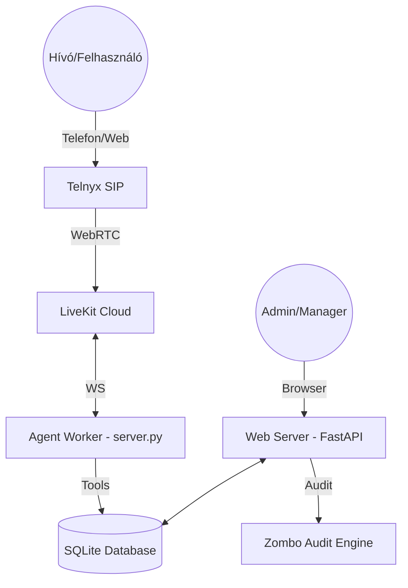

# Globális Architektúra Áttekintő — ThinkAI Voice Agent

**Utolsó frissítés:** 2026-07-03

## Rendszerstruktúra

A projekt két fő folyamatból áll, amelyek párhuzamosan futnak:

1. **Agent Worker (`server.py`)**: 
   - LiveKit ágens, amely a hangfolyamatokat kezeli.
   - Pipeline: Soniox (STT) → Gemini 2.5 Flash (LLM) → Cartesia (TTS).
   - Valós idejű eszközhasználat (Tools) a naptár és email kezeléshez.

2. **Web Server (`web_server.py`)**: 
   - FastAPI alapú REST API és Admin felület kiszolgáló.
   - Kezeli a hitelesítést, a dashboardot és a marketing modulokat (pl. Zombo).

## Technológiai Architektúra

## Adatfolyam és Integrációk

- **Hangfeldolgozás**: Az audio adatok a LiveKit-en keresztül érkeznek, a Worker pedig harmadik fél szolgáltatókat (Soniox, Cartesia) használ a konverzióhoz.
- **Döntéshozatal**: A Gemini LLM a `tools.py`-ban definiált függvényeket hívja meg az adatbázis módosításához.
- **Értesítések**: A `email_processor.py` figyeli az adatbázist és Brevo-n keresztül küldi ki a szükséges emlékeztetőket.
